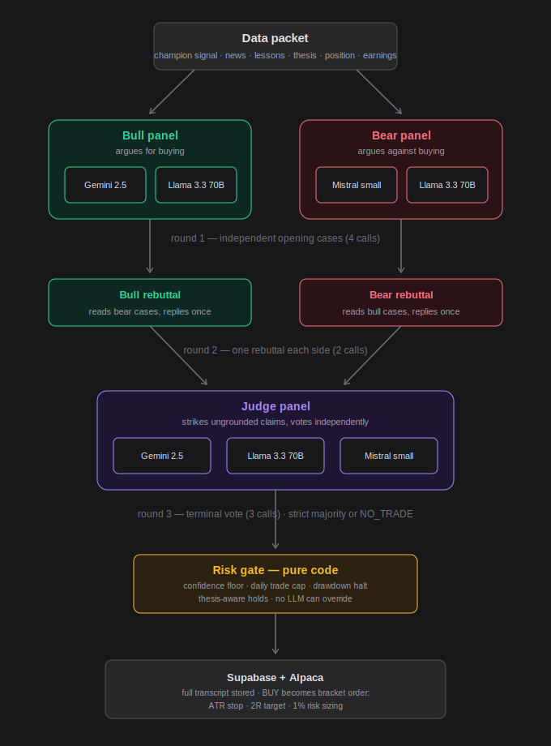
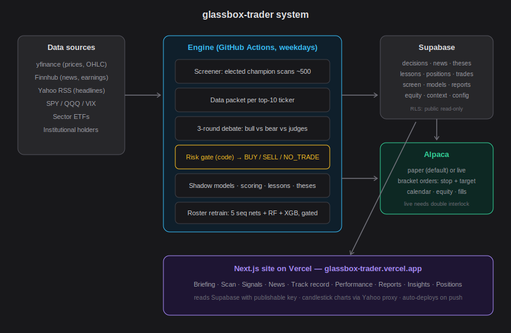
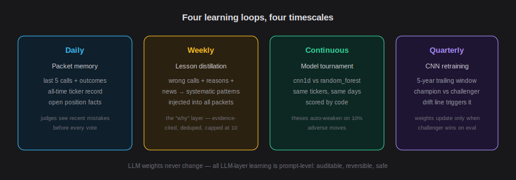

# glassbox trader

**Independent AI panels debate every stock decision — and show their work.
The system grades itself nightly, elects its own brain weekly, and retrains
itself when its own scorecard demands it.**

glassbox-trader is a fully autonomous trading research system. Every weekday morning it scans the
**current** S&P 500 (self-refreshed monthly), picks the most interesting names, makes three AI
model families argue about each one over sealed evidence, lets a hard-coded risk gate have the
final word, executes on a paper brokerage account, and then grades itself against what the market
actually did. Every decision, argument, vote, mistake, and lesson is public. Nothing is hidden —
that is the product.

It also applies concepts taught by professional traders — order blocks, liquidity sweeps,
market structure, volatility capitulation, trailing exits — but **never on faith**: each concept
was admitted only if it is mechanically computable and causal, it enters debates as citable
evidence rather than as a trading rule, and the system's own scored track record decides which
concepts actually predict.

> Educational project. Nothing here is financial advice.

---

## How a decision is made



Every weekday at 12:37 UTC (pre-market ET), GitHub Actions runs the engine:

**1. Market check.** Alpaca's calendar confirms the market opens today — holidays are skipped.
A factual market snapshot (S&P 500, Nasdaq, VIX) is computed by code and stored.

**2. Watchlist — pins first, then the whole universe.** Any tickers pinned on the dashboard's
**/watchlist** control page jump the queue (pins bypass cooldown). The remaining slots are
filled by the screener: the **elected champion model** scans the current ~503-ticker universe in
one batch, scoring each name by directional conviction + abnormal 1-day move + abnormal volume.
Top-ranked names fill most slots (minus anything debated in the last 2 days — cooldown
rotation), and **5 exploration wildcards** are sampled from quiet mid-ranked names daily to
counter momentum bias — so unremarkable-looking stocks still get their day in court.

**3. The data packet — the only permitted evidence.** For each debated ticker, code assembles a
sealed packet: the elected champion's signal (direction, confidence, RSI, 5/10-day returns,
price vs 50-day MA, volume ratio, sector-relative strength), a **technical structure block**
(below), the **overnight gap** vs prior close from pre-market prints, days until earnings, the
5 freshest headlines with finance-aware sentiment, the last 5 decisions on this ticker **with
their real outcomes**, the all-time scored record on this ticker, distilled lessons from past
mistakes, any active long-horizon thesis, the current open position (if held), and the market
snapshot.

**The technical structure block** is where the professional traders' playbook lives. Thirty-plus
hours of trading education were distilled through one filter — *mechanically computable, causal,
testable* — into 40 leak-safe features (every value at bar *t* uses only information available at
bar *t*, verified by a truncation harness). The packet cites the decision-relevant ones: market
structure state (break of structure / change of character), 50- and 200-day EMA regimes,
unmitigated fair-value-gap / order-block zones, **liquidity sweeps** (equal-high/low clusters
wicked through and reclaimed — the stop-hunt distinguished from a real breakdown), **Williams
VIX Fix capitulation** flags, the **first pullback** after a fresh structure break, **range
regime** (ranging flag, position within range, Bollinger squeeze), RSI divergences detected only
at confirmed pivots, volume-profile point of control, candle anatomy, volume trend, and ATR
chandelier levels. Concepts that failed the filter were rejected with reasons: hand-drawn
trendlines (subjective geometry), Heikin Ashi (information-destroying smoothing), harmonics,
Gann, Elliott waves, and every paywalled indicator kit.

**4. The debate — fixed three rounds, terminates by construction.**
- **Round 1:** the bull panel (Gemini 2.5 Flash + Llama 3.3 70B) and the bear panel
  (Mistral Small + Llama 3.3 70B) each write independent opening cases. Every claim must cite a
  packet field by name (`technical_structure.bull_liquidity_sweep_bars_ago`,
  `news[2].headline`). Claims citing facts not in the packet get struck.
- **Round 2:** one rebuttal per side.
- **Round 3:** three judges (one per model family) read everything, strike ungrounded claims,
  and vote BUY / SELL / NO_TRADE independently. A **strict majority** is required; ties, missing
  votes, and malformed replies all default to NO_TRADE. There is no loop and no model-controlled
  flow — the code calls each stage once and stops.
- **Per-seat provider fallback:** if a provider is down or rate-limited, its seat is filled by
  any healthy provider not already used for that role (and the substitution is logged). An API
  outage can degrade a debate, but it can no longer silence one *side* of it — a failure mode
  observed live and engineered out.

Three different companies' models are used deliberately: their errors are decorrelated, so a
majority vote filters mistakes instead of amplifying shared bias. In live runs, judges have
struck exaggerations ("RSI 60.3 is high") and unverifiable claims made by other models.

**5. The risk gate — pure code, no LLM can override it.** The verdict passes through hard rules:
a **two-judge quorum** (no action ever stands on a single judge's vote — outage-day verdicts
gate to NO_TRADE), average judge confidence ≥ 0.5, max 3 trades/day, a 10% peak-to-trough
**drawdown halt** that blocks all new entries, and thesis-aware annotations (a SELL against an
active LONG thesis is flagged). The gate's word is final.

**6. Execution (paper).** A surviving BUY becomes **two bracket orders** on Alpaca: a **scalp
half** that takes profit at 1R and a **runner half** targeting 2R, sharing a stop-loss at
1.5× ATR(14) below entry. Position size = account equity × 1% ÷ stop distance, capped at 10% of
equity per position. A **chandelier stop ratchet** then trails every open stop toward
`max(high) − 3×ATR` twice daily (morning run + a dedicated 17:43 UTC midday management run) —
stops only ever tighten, never loosen. Positions also close on a SELL vote or after 10 days
(time exit) — unless an active thesis justifies holding — with open bracket legs cancelled
first so liquidation cannot be blocked. Long-only; no shorting.

**7. Scoring — by code, never by LLM self-grading.** At 22:43 UTC the scorer compares each
decision against the **first market close after** the decision was made (never against the past;
incomplete days wait). NO_TRADE before a big move is counted as a "missed opportunity",
separately from real wrong calls — the track record page shows both, unedited.

---

## System architecture



| Component | What it does |
|---|---|
| `src/pipeline/` | The ML pipeline: features (RSI, MACD, Bollinger, lags, sector-relative), **`ta_structure.py`** (the 40-feature causal structure library), sequence models, and `retrain_cnn.py` (trailing retrain of the full roster behind evidence gates, dethroned champions preserved) |
| `src/inference/` | Live feature building from yfinance + model loading and prediction |
| `src/engine/screener.py` | Full-universe batch scan and interest ranking (current constituents) |
| `src/engine/data_packet.py` | Assembles the sealed evidence packet (incl. structure block + overnight gap) |
| `src/engine/panels.py` / `protocol.py` | Prompts, grounding contract, per-seat provider fallback, and the fixed 3-round state machine |
| `src/engine/risk_gate.py` | Hard-coded limits — judge quorum, confidence floor, trade cap, thesis awareness |
| `src/engine/execution.py` | Alpaca split-bracket entries (1R scalp + 2R runner), ATR stops, 1%-risk sizing, drawdown halt, time exits, cancel-then-close liquidation, paper/live interlock |
| `src/engine/stop_ratchet.py` | The chandelier trailing-stop ratchet (never loosens) |
| `src/engine/retrain_trigger.py` | Performance-triggered, anomaly-guarded self-dispatch of the retrain workflow |
| `src/engine/memory.py` | Validated Supabase layer — 12 tables, ticker regex on every entry point |
| `src/engine/shadow.py` | Records every competitor's daily prediction for the tournament |
| `src/engine/lessons.py` | Weekly distillation of systematic mistakes into reusable guidance |
| `src/engine/thesis.py` | Long-horizon theses with code-enforced honesty (10% adverse move auto-weakens) |
| `src/engine/performance.py` | Syncs equity curve and FIFO-matched closed trades from Alpaca |
| `src/engine/run_daily.py` | Orchestrates daily / manage / score / weekly modes |
| `scripts/build_universe.py` | Rebuilds the current S&P 500 constituent list (also run monthly by CI) |
| `web/` | Next.js 15 dark dashboard, 10 pages incl. the /watchlist control surface, deployed on Vercel |
| `.github/workflows/` | `engine.yml` (five cron schedules), `retrain.yml` (manual **or self-dispatched**), `universe.yml` (monthly constituent refresh) |

**Data sources and what each contributes:** yfinance (prices — the signal models' food; plus
pre/post-market prints for the overnight gap), Wikipedia (current S&P constituents, monthly),
Finnhub (structured news + earnings calendar), Yahoo RSS (headlines), VADER + finance lexicon
(sentiment), SPY/QQQ/VIX (regime), SPDR sector ETFs (relative strength), yfinance institutional
holders (thesis evidence — positions are facts, opinions are noise), Alpaca (execution, account
truth, market calendar).

---

## How it learns — and improves itself



The system's autonomy has three tiers: **daily** it decides trades, **weekly** it elects its own
brain, and **when its performance demands it**, it retrains its entire roster — with guards
against fooling itself at every tier.

- **Daily:** every packet shows judges the ticker's recent calls *with outcomes* and its all-time
  record. Mistakes are visible before every vote.
- **Weekly:** the lesson distiller collects wrong calls — with the judges' stated reasoning, the
  signal, and the news that preceded each — and asks for at most 2 **systematic** patterns
  (not one-off bad luck), each citing its evidence cases. Surviving lessons are deduped, capped
  at 10 active, and injected into every future debate. This is the "why" layer.
- **Continuous:** a shadow tournament records every competitor's prediction on identical tickers
  and days — **nine competitors**: five sequence architectures (cnn1d, LSTM, GRU, TCN,
  Transformer), two tabular families (Random Forest, XGBoost), a free **ensemble** entrant, and
  **`cnn1d_prev`** — the previous champion's exact weights, kept competing as a live control so
  a bad succession is detectable and reversible. Code scores everyone; the Signals page charts
  the standings and the cumulative race. Theses are re-examined weekly and auto-weakened if the
  market moves 10% against them.
- **Weekly election:** the tournament is not just a scoreboard — it **governs**. Every Saturday,
  whichever *routable* model has the better rolling hit rate (minimum 20 scored predictions and
  a clear +5-point margin so the title cannot flip-flop) is elected champion, and from Monday
  the screener and every data packet run on the winner.
- **Self-dispatched retraining:** after the election, the weekly review evaluates two
  performance signals — champion hit rate decaying toward the ~33% random baseline (over ≥40
  scored predictions), or any shadow model beating the champion by ≥7 points over ≥30 — and if
  either fires outside a 14-day cooldown, it **dispatches the retrain workflow itself** via the
  GitHub API. An **anomaly guard** holds the trigger when the *entire* roster decayed together:
  that is the market breaking, not the model, and retraining would only chase the chaos — the
  Saturday log says so explicitly.
- **The retrain** fits all architectures on a trailing window of the **current** universe with
  strictly chronological splits and inverse-frequency class weighting. Each model faces its own
  gate: the best sequence challenger deploys only if it beats the incumbent on untouched recent
  data (the RF has a mini-gate with a repo size guard), the dethroned incumbent joins the
  tournament as `_prev`, and old artifacts are archived, never destroyed.
- **LLM judge scoreboard:** every judge vote is stored beside its outcome, so each provider
  (Gemini, Llama, Mistral) gets a public accuracy ranking — BUY↔Up, SELL↔Down, NO_TRADE↔Neutral —
  charted on the Signals page.

So the system genuinely evaluates itself, retrains itself, and gates its own upgrades. Whether
each upgrade *was* an improvement is never assumed — the dethroned champion keeps competing
precisely so the data can veto the succession.

The LLMs' weights never change. All LLM-layer learning is prompt-level — auditable (every lesson
is a readable sentence with cited evidence), reversible, and immune to the failure modes of
fine-tuning on noisy market feedback. The components where weight-learning is appropriate — the
signal models, with clean supervised labels — are exactly the ones that get it.

---

## The models

| Role | Model | Provider | Swap via |
|---|---|---|---|
| Bull panel | Gemini 2.5 Flash + Llama 3.3 70B | Google, Groq | `BULL_PANEL`, `GEMINI_MODEL`, `GROQ_MODEL` |
| Bear panel | Mistral Small + Llama 3.3 70B | Mistral, Groq | `BEAR_PANEL`, `MISTRAL_MODEL` |
| Judges | all three families (any healthy provider can fill an empty seat) | — | `JUDGE_PANEL` |
| Thesis agent & lesson distiller | Gemini 2.5 Flash | Google | `GEMINI_MODEL` |
| Signal engine | elected champion (currently a 1D-CNN retrained on the current universe) | trained in-repo | weekly election + roster retrain |
| Shadow challengers | cnn1d_prev, LSTM, GRU, TCN, Transformer, Random Forest, XGBoost, ensemble | trained in-repo | RF electable weekly; sequence models promoted via retrain gate |

cnn1d took the initial title on empirical grounds: a 20-configuration bake-off (LSTM, GRU, TCN,
CNN, Transformer × regression/classification heads) where classification beat regression
0.44–0.47 vs 0.15–0.39 macro F1 and cnn1d won the held-out test at **0.4679** with balanced
per-class scores; tabular models ceilinged at ~0.39–0.41 in the same study. Out-of-sample, all
price-only models trained on the original 2010–2016 era decayed toward ~0.35 from regime drift —
which is exactly why retraining is built in. The first live retrain (July 2026) proved the
point: the same CNN architecture retrained on the current 503-ticker universe scored **0.52**
on held-out recent days against the aging incumbent's **0.40**, won the gate, and deployed —
while the old weights keep competing in the tournament as `cnn1d_prev` so the succession itself
remains falsifiable.

---

## Operating modes

| Mode | What it means | How it's enabled |
|---|---|---|
| **RESEARCH** | Signals and debates only, no orders anywhere | default with no Alpaca keys |
| **PAPER** (current) | Simulated orders on an Alpaca paper account | `TRADING_MODE=paper` (or `PAPER_TRADING=true`) + paper keys |
| **LIVE** | Real money, own account only | double interlock: `TRADING_MODE=live` **and** `LIVE_TRADING_CONFIRM=I_UNDERSTAND_REAL_MONEY`, plus live keys |

A single stray variable can never reach real money — both live switches must be deliberately set,
and every run logs its mode and endpoint. Live trading is for the owner's account only;
executing for others is regulated investment-adviser territory.

---

## Automation schedule (GitHub Actions, UTC)

| When | Mode | What happens |
|---|---|---|
| Weekdays 12:37 | `daily` | holiday check → market snapshot → pins + universe scan → debates → gate → paper orders → position & performance sync → stop ratchet → stale-position management |
| Weekdays 14:07 | `daily` (catch-up) | re-runs only if GitHub dropped the primary; the idempotency guard makes it a no-op otherwise |
| Weekdays 17:43 | `manage` | midday stop ratchet + time exits — no debates, no LLM calls |
| Weekdays 22:43 | `score` | decisions and shadow predictions graded against the completed session |
| Saturday 14:13 | `weekly` | scoring sweep → performance report → tournament → election → **retrain-trigger evaluation** → paper P&L → thesis review → lesson distillation → news pruning → report row |
| Monthly (1st) | `universe` | current S&P constituents refreshed from Wikipedia; commits only on change |
| Manual **or self-dispatched** | `retrain` | trailing-window, class-weighted retrain of the full roster on the current universe; challengers deploy only through their gates; dethroned champion preserved as a shadow competitor |

---

## The website

Ten pages, all reading Supabase live (public read-only under Row Level Security):
**Briefing** (market banner + today's verdict cards) · **Scan** (the full ranking, debated names
highlighted) · **Signals** (live signal cards, confidence over time, the **model tournament**
standings and race chart, and the **LLM judge accuracy** scoreboard) · **News** (every archived
headline with sentiment) · **Track record** (every scored call, rolling hit rate vs random
baseline, wrong vs missed counted separately, **CSV export**) · **Performance** (paper equity vs
SPY, closed trades with realized P&L, **CSV export**) · **Reports** (the engine's weekly
self-audits) · **Insights** (theses and lessons) · **Positions** (open paper holdings and gate
interventions) · **Watchlist** (the system's one human control surface — token-gated pins that
jump the next morning's queue). Debate pages open with a 6-month candlestick chart marking the
decision moment.

---

## Setup

```
# .env at repo root (see .env.example)
GEMINI_API_KEY=          # aistudio.google.com
GROQ_API_KEY=            # console.groq.com
MISTRAL_API_KEY=         # console.mistral.ai
FINNHUB_API_KEY=         # finnhub.io
SUPABASE_URL=            # supabase project settings
SUPABASE_KEY=            # publishable key (site reads)
SUPABASE_SERVICE_KEY=    # secret key (engine writes)
ALPACA_API_KEY=          # alpaca.markets paper keys
ALPACA_SECRET_KEY=
PAPER_TRADING=true
```

1. Run the SQL files in `src/engine/` (schema, RLS, screen_results, model_predictions,
   performance, reports, config) in the Supabase SQL editor — **12 tables total**, all with
   row level security enabled and public read-only policies.
2. Mirror the keys as GitHub Actions secrets; add repo variables `PAPER_TRADING=true`
   (optionally `DEBATE_BUDGET`, `EXPLORE_SLOTS`, `GROQ_MODEL`, `TRADING_MODE`).
3. Deploy `web/` on Vercel (root directory `web`) with `NEXT_PUBLIC_SUPABASE_URL`,
   `NEXT_PUBLIC_SUPABASE_ANON_KEY`, `NEXT_PUBLIC_SITE_MODE=PAPER`, plus
   `SUPABASE_SERVICE_KEY` and `WATCHLIST_ADMIN_TOKEN` for the /watchlist control page.
4. Run `python scripts/build_universe.py` once to seed the current constituent list
   (CI refreshes it monthly thereafter).
5. Local run: `export STOCK_LENS_BASE=$PWD/stock-lens-data PYTHONPATH=$PWD/src` then
   `python -m engine.run_daily --mode daily` (or `manage` / `score` / `weekly`).

Free-tier budget: the repo is public, so GitHub Actions minutes are unlimited on standard
runners. At `DEBATE_BUDGET=30`, Gemini uses roughly a third of its free daily request cap;
Groq's token-per-minute ceiling produces occasional 429s that the retry logic and per-seat
fallback absorb by design. A per-run circuit breaker skips any provider after three consecutive
failures — and because panels fall back seat-by-seat and the gate enforces a two-judge quorum,
a provider outage degrades gracefully instead of biasing decisions. Models, panels, and budgets
are all env-swappable, so provider limit changes are a variable edit, not a code change.

---

## Honest limitations (and what mitigates them)

- The signal models' out-of-sample edge is thin (~0.35 macro F1 vs 0.33 random for the original
  2016-era CNN; every price-only model faces a similar ceiling under regime drift). They are
  calibrated priors that discipline the debate, not oracles. **Mitigations:** continuous drift
  monitoring, the performance-triggered full-roster retrain (the first of which lifted held-out
  macro-F1 from 0.40 to 0.52 by training on the current universe), and the weekly election —
  but note honestly that comparison and election *select among* models; they do not raise any
  model's ceiling. The ceiling of the price-only family is the founding argument for the
  news-reading LLM layer above it.
- The trader-education concepts in the structure block are hypotheses, not edges. Each was
  admitted for computability, not proven profitability; some fields may turn out to be noise on
  daily bars. **Mitigation:** every decision stores the evidence it cited, so the scored track
  record can measure — and retire — any concept that doesn't earn its place.
- The screener leans toward movers and conviction by construction. **Mitigation:** five daily
  exploration wildcards sampled from quiet mid-ranked names, plus user pins, so the debated
  population is no longer purely momentum-selected — though top slots still favor "interesting"
  days, and track-record stats should be read with that in mind.
- Direction accuracy is not profitability. **Mitigations:** the weekly report tracks the average
  next-day return following BUY and SELL calls (a profitability proxy available immediately),
  and the Performance page tracks real trade-level P&L against SPY — the number that ultimately
  matters. Time is the one input that cannot be engineered; months of paper trading are the test.
- Free-tier LLM limits shape the design. **Mitigations:** trimmed prompts, env-swappable
  models/panels/budgets, per-seat provider fallback, the judge quorum, and a per-provider
  circuit breaker — but provider limits change without notice, and the honest long-term fix is
  the first paid dollar.

**Disclaimer:** educational research output only — nothing here is financial advice. Every
decision shown was produced by AI models debating public data, gated by hard-coded risk rules,
executed (if at all) on a simulated account.

© 2026 Siddhartha Roy — source viewable for portfolio purposes; all rights reserved. See LICENSE.